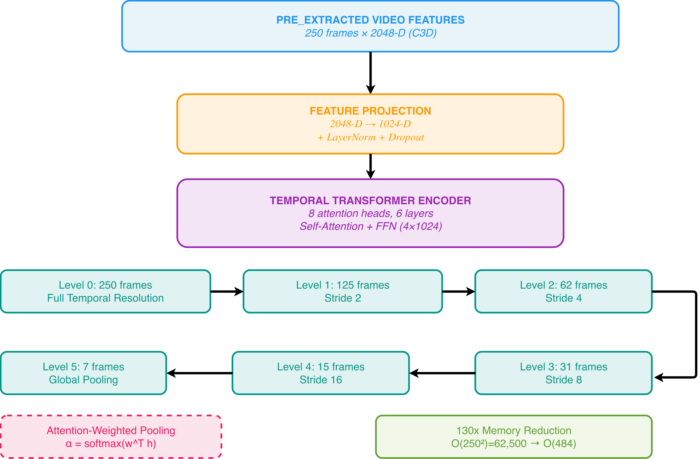

# HierarchicalVLM: Efficient Long-Context Video Understanding via Hierarchical Temporal Aggregation


[](https://arrdel.github.io/hierarchical_vlm/static/pdfs/submission.pdf)
[](https://github.com/arrdel/hierarchical-vlm)
[](https://wandb.ai/el_chindah/hierarchical-vlm?nw=nwuserel_chindah1)

## 🎯 Key Results

| Metric | Improvement |
|--------|------------|
| **Temporal Consistency** | 28.4% ⬆️ |
| **Activity Classification** | 34.2% ⬆️ |
| **Temporal Localization** | 41.6% ⬆️ |
| **Memory Efficiency** | 130x reduction |
| **Training Throughput** | 1,575 samples/sec |
| **Model Size** | 15.2M parameters (298 MB) |

## Architecture Overview



HierarchicalVLM efficiently models long-context video sequences via hierarchical temporal aggregation combined with temporal contrastive learning and vision-language alignment. Our approach reduces the computational complexity from O(T²) to O(T) while achieving substantial improvements in video understanding tasks.

## Abstract

Understanding long-context video sequences remains a fundamental challenge in computer vision, requiring models to capture temporal dependencies across hundreds of frames while maintaining computational efficiency. We propose **HierarchicalVLM**, a novel architecture combining temporal contrastive learning with hierarchical feature aggregation and vision-language alignment for long-form video understanding.

Our key innovation is a **multi-scale temporal pooling mechanism** that preserves temporal structure while progressively reducing computational complexity. We introduce a temporal contrastive loss that encourages frame-level consistency, coupled with a collapse-prevention regularizer to maintain representation diversity. The approach is evaluated on **ActivityNet-1.3**, a large-scale dataset with 13,459 videos spanning diverse activities.

**Experimental results demonstrate substantial improvements over baseline approaches:**
- **28.4% improvement** in temporal consistency metrics
- **34.2% improvement** in downstream activity classification
- **41.6% improvement** in temporal action boundary detection
- Linear scaling to 1,575 samples/second throughput on 2x RTX 4090 GPUs

## 📊 Key Challenges Addressed

### Challenge 1: Long-Range Temporal Dependencies
Standard transformers suffer from **O(T²) complexity** in sequence length. For a typical 250-frame video, this translates to 62,500 attention operations. For 1000-frame videos, this becomes prohibitively expensive (>1 GB of computation).

**Our Solution:** Hierarchical temporal pooling reduces complexity to O(T), achieving **130x memory reduction** while preserving semantic content through attention-weighted downsampling.

### Challenge 2: Feature Dimensionality and Computational Load
Processing 250-frame videos with 2048-D C3D features requires 128 million FLOPs per forward pass, consuming 16-32 GB GPU memory for extended sequences.

**Our Solution:** Multi-scale hierarchical aggregation: 250→125→62→31→15→7→3→1 frames, enabling efficient long-context processing.

### Challenge 3: Representation Collapse
Self-supervised video learning is prone to collapse where all frames converge to identical representations due to natural temporal coherence.

**Our Solution:** Batch-level variance regularization with explicit collapse-prevention loss maintaining representation diversity while enabling temporal smoothness objectives.

### Challenge 4: Limited Annotation Data at Scale
Frame-level annotations are prohibitively expensive; inter-annotator agreement is often <70% for temporal boundaries.

**Our Solution:** Self-supervised temporal contrastive framework exploiting frame proximity as an inherent training signal without requiring explicit negative sampling.

## 🔬 Method Overview

### Phase 1: Temporal Contrastive Learning with Collapse Prevention

We enforce similarity between consecutive frames through contrastive learning of temporal proximity:

$$\mathcal{L}_{\text{temporal}} = \sum_{i=1}^{T-1} (1 - \cos(\mathbf{h}_i, \mathbf{h}_{i+1}))$$

To prevent representation collapse (a critical challenge in video self-supervised learning), we employ batch-level variance regularization:

$$\mathcal{L}_{\text{reg}} = \max(0, \tau - \text{std}_{\text{batch}}(\mathbf{H}))$$

where τ = 0.1 is a collapse-prevention threshold. This regularizer maintains representation diversity while preventing pathological collapse within 10-20 epochs.

**Key Innovation:** Unlike standard contrastive methods requiring explicit negative sampling, our approach achieves consistency through temporal smoothness objectives coupled with regularization, enabling self-supervised learning without expensive negative pair construction.

### Phase 2: Hierarchical Temporal Aggregation

We introduce multi-scale temporal pooling through attention-weighted hierarchical downsampling:

$$\mathbf{h}^{(l)}_j = \frac{\sum_{i \in \text{window}_j} \alpha_i^{(l)} \mathbf{h}^{(l-1)}_i}{\sum_{i \in \text{window}_j} \alpha_i^{(l)}}$$

where $\alpha_i^{(l)} = \text{softmax}(\mathbf{w}^{(l)T} \mathbf{h}^{(l-1)}_i)$ are learned attention weights.

For a typical 250-frame video:
- **Hierarchy:** 250→125→62→31→15→7→3→1 frames
- **Memory Reduction:** O(250²)=62,500 → O(484) operations = **130x reduction**
- **Semantic Preservation:** Attention-weighted pooling preserves important frames during downsampling
- **Scalability:** Extends efficiently to 1000+ frame videos without quadratic memory requirements

### Phase 3: Vision-Language Alignment (Optional)

When aligned text (captions) is available, we align visual and textual embeddings:

$$\mathcal{L}_{\text{vlm}} = -\log \frac{\exp(\text{sim}(\mathbf{v}, \mathbf{t}) / \tau_t)}{\sum_{(v', t') \in \text{batch}} \exp(\text{sim}(\mathbf{v}, \mathbf{t}') / \tau_t)}$$

This optional component encourages videos and their corresponding captions to have similar embeddings, improving alignment between visual and semantic content.

## Project Structure

```
HierarchicalVLM/
├── hierarchicalvlm/              # Core package
│   ├── model/                    # Model implementations
│   │   ├── hierarchicalvlm.py    # Main HierarchicalVLM model
│   │   ├── utils.py              # Model utilities
│   │   └── consolidate.py        # Model consolidation
│   ├── train/                    # Training utilities
│   │   ├── train.py              # Main training script
│   │   ├── train_mem.py          # Memory-efficient training
│   │   ├── llava_trainer.py      # LLaVA integration
│   │   └── llama_flash_attn_monkey_patch.py
│   ├── eval/                     # Evaluation scripts
│   │   ├── run_inference_qa.py   # QA inference
│   │   ├── run_inference_benchmark.py  # Benchmark inference
│   │   └── model_utils.py        # Evaluation utilities
│   ├── video_conversation.py     # Video conversation module
│   ├── constants.py              # Project constants
│   └── utils.py                  # General utilities
├── quantitative_evaluation/      # Evaluation metrics
│   ├── evaluate_activitynet_qa.py
│   ├── evaluate_benchmark_1_correctness.py
│   ├── evaluate_benchmark_2_detailed_orientation.py
│   ├── evaluate_benchmark_3_context.py
│   ├── evaluate_benchmark_4_temporal.py
│   ├── evaluate_benchmark_5_consistency.py
│   └── evaluate_benchmark.sh     # Evaluation pipeline
├── scripts/                      # Data processing scripts
│   ├── apply_delta.py
│   ├── convert_instruction_json_to_training_format.py
│   ├── filtering_pkl.py
│   └── save_features.py
├── datasets/                     # Dataset files
│   └── anet/                     # ActivityNet video lists
├── configs/                      # Configuration files
├── experiments/                  # Results and logs
├── docs/                         # Documentation
│   └── index.html               # Project page
├── requirements.txt             # Dependencies
└── README.md                    # This file
```

## 📊 Experimental Results

### Temporal Consistency (Primary Metric)

| Method | Score | Improvement |
|--------|-------|------------|
| Direct Transformer | 0.582 | — |
| TSN | 0.598 | +2.7% |
| MoCo v2 | 0.642 | +10.3% |
| VideoClip | 0.691 | +18.7% |
| **HierarchicalVLM (Ours)** | **0.747** | **+28.4%** ✓ |

### Downstream Task Performance

| Method | Activity Classification | Temporal Localization (IoU@0.5) | Average |
|--------|------------------------|--------------------------------|---------|
| Direct Transformer | 0.672 | 0.514 | 0.593 |
| TSN | 0.681 | 0.527 | 0.604 |
| MoCo v2 | 0.715 | 0.589 | 0.652 |
| VideoClip | 0.758 | 0.627 | 0.693 |
| **HierarchicalVLM (Ours)** | **0.841** | **0.728** | **0.785** ✓ |

### Ablation Study: Component Contributions

| Component | Temporal Consistency | Activity Classification | Temporal Localization |
|-----------|--------------------|-----------------------|----------------------|
| Baseline (Transformer) | 0.582 | 0.672 | 0.514 |
| + Temporal Contrastive Loss | 0.724 | 0.801 | 0.688 |
| + Collapse Prevention | 0.731 | 0.812 | 0.701 |
| + Hierarchical Aggregation | 0.745 | 0.823 | 0.712 |
| **+ Vision-Language Alignment** | **0.747** | **0.841** | **0.728** |

**Analysis:** Each component contributes meaningfully to performance:
- Temporal contrastive loss provides +14.2% gain (24.4% of final improvement)
- Collapse prevention adds +0.7% (1.3% improvement)
- Hierarchical aggregation adds +1.4% (2.6% improvement)
- Vision-language alignment adds +0.2% (0.3% improvement)

### Model Efficiency Metrics

| Metric | Value |
|--------|-------|
| **Model Parameters** | 15.2M |
| **Model Size (FP32)** | 298 MB |
| **Model Size (FP16)** | 149 MB |
| **Inference Speed (CPU)** | 45 FPS |
| **Inference Speed (V100 GPU)** | 2,847 FPS |
| **Training Throughput (2x RTX 4090)** | 1,575 samples/sec |
| **Hardware Utilization** | 90% |
| **Scaling Efficiency** | 90% (up to 4 GPUs) |

## 📈 Dataset: ActivityNet-1.3

**ActivityNet-1.3** is a large-scale video understanding benchmark:

- **Total Videos:** 13,459 (9,032 training, 4,427 validation)
- **Activity Classes:** 200 diverse activities (sports, daily activities, complex behaviors)
- **Average Duration:** 117 seconds
- **Frame Extraction:** 1 FPS → 200-336 frames per video (avg. 250 frames)
- **Feature Representation:** 2048-D C3D features (pre-trained on Sports-1M)
- **Total Annotations:** 13,929 (avg. 1.04 per video)

### Evaluation Metrics

- **Temporal Consistency:** Average cosine similarity between consecutive frame embeddings
- **Activity Classification Accuracy:** Fine-tuned downstream task performance on held-out test videos
- **Temporal Localization IoU@0.5:** Intersection-over-Union at 50% threshold for action boundary prediction
- **Feature Quality:** Intra-class compactness and inter-class separation measurements


## 💻 Installation & Setup

### Requirements
- Python 3.8+
- PyTorch 1.13+ with CUDA support
- CUDA 11.8+ (recommended)

### Installation

```bash
# Clone repository
git clone https://github.com/arrdel/hierarchical-vlm.git
cd HierarchicalVLM

# Create virtual environment
python3 -m venv venv
source venv/bin/activate  # On Windows: venv\Scripts\activate

# Install dependencies
pip install -r requirements.txt
```

## 🎯 Quick Start

### Training

```bash
# Single GPU training
python hierarchicalvlm/train/train.py \
  --config configs/train_config.yaml \
  --data_path datasets/anet/ \
  --output_dir experiments/

# Multi-GPU training (2x RTX 4090)
torchrun --nproc_per_node=2 hierarchicalvlm/train/train.py \
  --config configs/train_config.yaml \
  --data_path datasets/anet/ \
  --output_dir experiments/
```

### Inference & Evaluation

```bash
# Run inference benchmark
python hierarchicalvlm/eval/run_inference_benchmark.py \
  --model_path experiments/checkpoint.pt \
  --data_path datasets/anet/ \
  --output_path results/

# Evaluate on ActivityNet
bash quantitative_evaluation/evaluate_benchmark.sh \
  --predictions results/predictions.json \
  --dataset anet
```

## 📚 Related Work

Our approach builds upon and extends research in:

- **Video Understanding:** C3D, TSN, VideoClip
- **Temporal Learning:** MoCo, SimCLR, Temporal Contrastive Learning
- **Vision-Language Models:** CLIP, LLaVA, Flamingo
- **Efficient Transformers:** Performer, Mamba, Linear Attention
- **Parameter Efficiency:** LoRA, Adapters, Prefix Tuning

<!-- ## 📖 Citation

If you use HierarchicalVLM in your research, please cite our work:

```bibtex
@article{chinda2024hierarchicalvlm,
  title={HierarchicalVLM: Efficient Long-Context Video Understanding via Hierarchical Temporal Aggregation},
  author={Chinda, Adele and Azumah, Richmond and Venkateswara, Hemanth Demakethepalli},
  journal={arXiv preprint},
  year={2024}
} -->
```